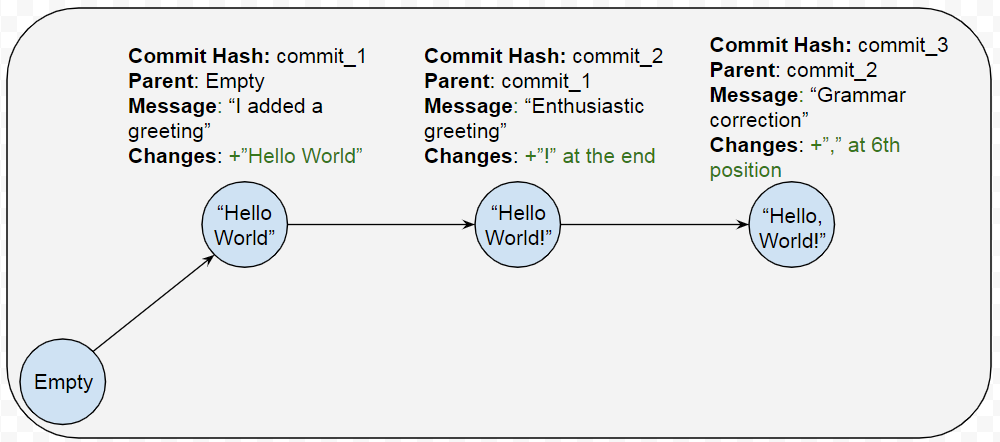
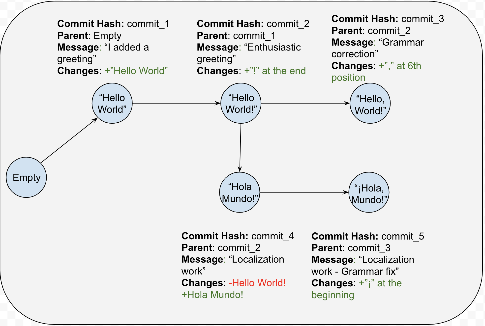
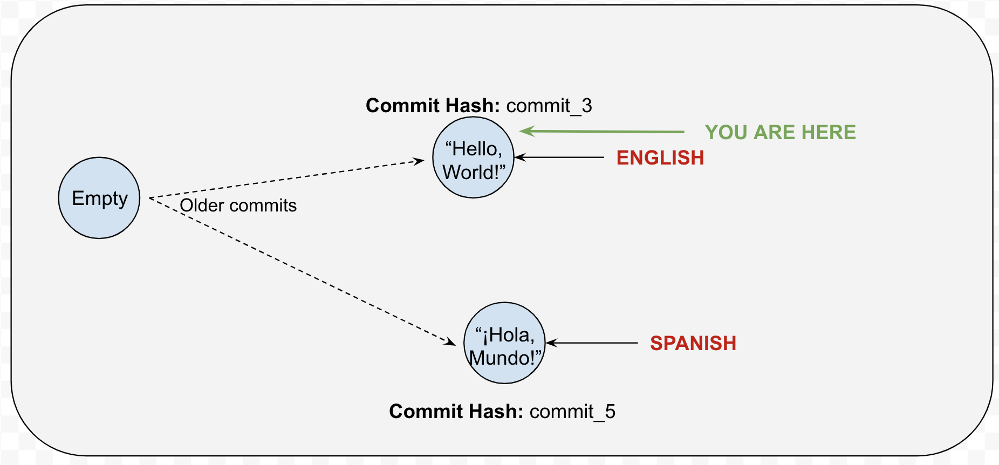
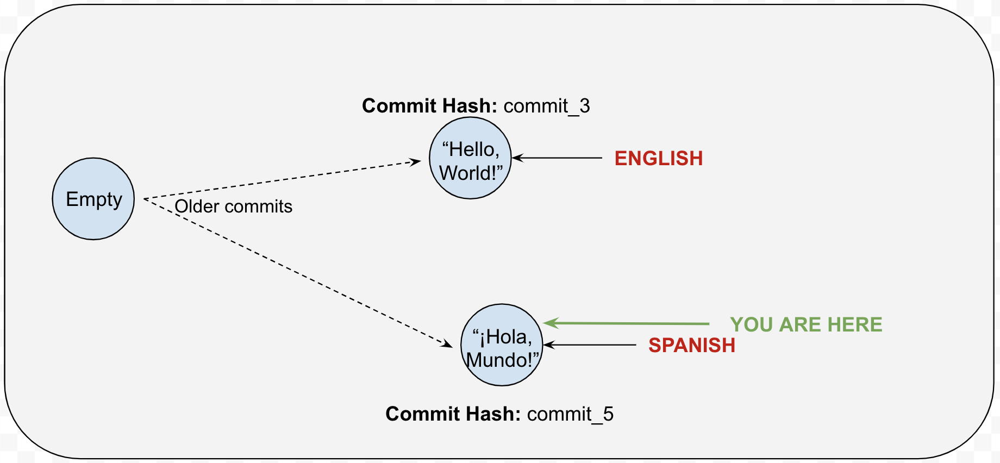
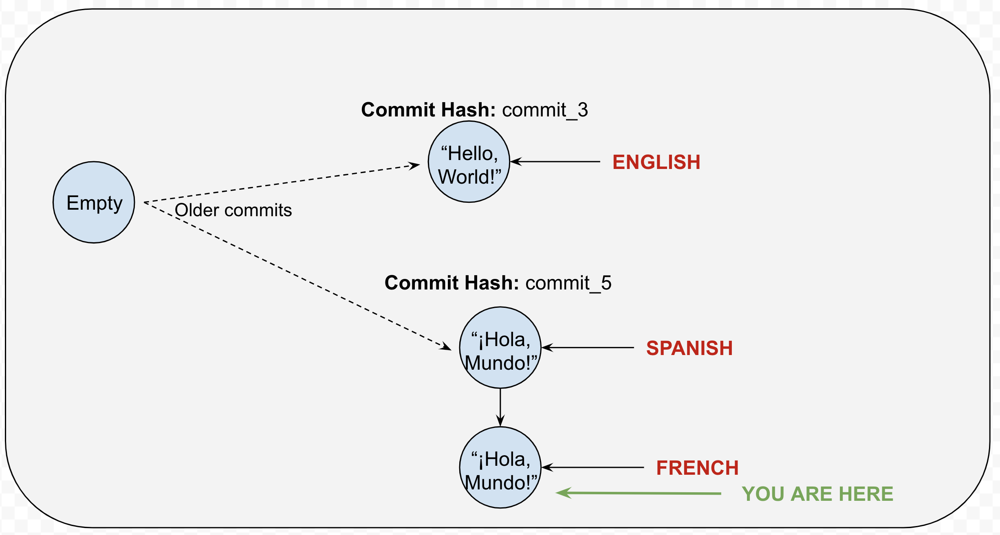

# Let's Git Going

**What this guide is:**

* A quick start and cheat sheet

* A place to start when facing Git for the first time

**What this guide isn’t:**

* A comprehensive Git internals explanation

* Written by an expert or anything close, I’m just a semi-proficient user that learnt a few tricks.

* A guide for a specific GUI or application, it mostly focuses on the terms and how the work on the Command Line.

This guide is accompanied by the [examples repository](https://github.com/sysnet-ai/git-going-examples/branches) which matches the repository in the figures along this guide.

**What the.. GIT?**

Git is a Version Control or Source Control System, fancy words apart, is just a tool to keep track of software as it changes over time. Remember all the _final.doc _final_2.doc _final_really_final.doc files you had to create while doing group projects in College? Git basically does that for you, in an automated way and provides tools to move to older versions to recover work as necessary or to newer versions to receive work from your teammates.

Whether you’re coming to Git as a user of other source control systems, or are just discovering them for the first time, the vocabulary and verbs can get really confusing.

So let’s git going (hehe) with some of the basics.

**Repository**

A repository (or ‘repo’ as the cool kids call it) is the project itself. Think of it as the container of *everything* related to your project.

Technically speaking, a repository is just a collection of **branches** and **commits.**

Usually when you join a project using git, the first thing you’ll need to do is to **clone** the repository. As the name suggests, you will, literally, create a **local** copy of the repository in your computer.

We’ll get into it later, but for now keep in mind that **local** and **remote** are important concepts for  git. If there’s one thing to remember about this let it be: **local** means it’s happening only in your computer and only you can see it, **remote** means it’s happening in some other computer and everyone can see it. **Remote** is equivalent to the ‘server’ or ‘depot’ in P4 and other Source Control Systems.

Now, remember we mentioned **branches** and **commits** make up the repository? Let’s define those:

**Commits**

A commit is a snapshot of the repository at a point in time.

Because of this, commits can be thought of as checkpoints: you can go back to them and recover your work from them.

If there is one thing to know and understand about commits is this: **If it has been committed, it can be recovered. And the opposite is true, if it was never committed, it is probably gone.**

Commits are identified by a unique ‘commit hash’. This is a 40 character-long alphanumeric sequence that looks like: `ca82a6dff817ec66f44342007202690a93763949`, but don’t worry about that, we’ll see that you’ll rarely even have to think about commit hashes.

Git keeps track of every change ever made to the repository from the beginning. It achieves that by using commit hashes.

For example - Imagine all the content in our repository is just the sentence "Hello World":

<table>
  <tr>
    <td>Contents</td>
    <td>Git’s perspective of what changed</td>
    <td>Commit hash</td>
  </tr>
  <tr>
    <td>"Hello World"</td>
    <td>+ Hello World</td>
    <td>commit_1</td>
  </tr>
  <tr>
    <td>“Hello World!”</td>
    <td>commit_1 + ! at the end.</td>
    <td>commit_2</td>
  </tr>
  <tr>
    <td>“Hello, World!”</td>
    <td>commit_2 + ‘,’ at position 6</td>
    <td>commit_3</td>
  </tr>
</table>

Commit hashes have all the information about the changes done to the content from the previous commit hash. Commit hashes also know which commit hash is their parent.

A visual representation of this would be something like:

If you have one commit hash, you can follow its parents and rebuild the state of the content, from the beginning. This is one of the most powerful characteristics of git.

Now, imagine we want to have a localized version of our content. We hire a translator and they get immediately to work. After some time, we end up with something that looks like:

From the image we can draw a few conclusions:

* Commit_3 has the latest content for English.

* Commit_5 has the latest content for Spanish.

* They both have Commit_2 as a common ancestor.

Remember commits are like checkpoints we can restore from or ‘go to’. So, if someone needed to see the Spanish version, they could jump to commit_5. If they wanted to work on the English version, then they’d go to commit_3.

However, remember that commits usually look like `ca82a6dff817ec66f44342007202690a93763949` and those are really hard to remember and keep track. Also, each commit is useful only as it is the newest in a chain. No one would want to work in commit_4, if commit_5 already existed, right?

Wouldn’t it be useful if we could give names to the commits? Or to have a way of always track the most recent commit in a chain?  -  Yes, that’d be awesome. And thankfully, that’s exactly what branches are for.

**Branches**

A Branch is just a nickname for a commit. That way we don’t have to remember names that are a bunch of random letters.

Back to our example, we could assume this workspace would have 2 branches: Spanish and English. That’d look like:

As you can see, ‘ENGLISH’ is  just a nickname for commit_3, and  ‘SPANISH’ is just a nickname to commit_5. The best thing? If our translator decided to add yet another version,  the nickname ‘SPANISH’ would follow. This way, branches give us easy to remember shorthands to commits, as well as keeps up with the latest commit for us.

The most recent commit in a branch is called the **‘HEAD’**. **Commit_3** is the HEAD of the **ENGLISH** branch. **Commit_6** is the HEAD of **SPANISH** branch. 

When discussing branches, it is important to note that most git repositories will have a branch named **‘master’**.

When the repository is first created, git creates a default branch: ‘master’. Because of this, most teams treat ‘master’ as the main branch, but there’s nothing special about it, it was just the first. There is nothing preventing the team creating a different branch ‘special’ or ‘Thanos’ and treating it as the main one.
Actually, the [examples repository](https://github.com/sysnet-ai/git-going-examples/branches) uses 'English' as its default branch as you can see.

Let’s take our example above. Some things that are true in this example and you might want to communicate to other team members:

* **Spanish** was **branched off English**. 

* **Spanish** was **branched off** after **commit_2** and before **commit_3.** Another way of saying this is that the **most recent common commit** between **English** and **Spanish**, is **commit_2**

Every branch is created **from** another branch. And relationships between branches are very important for working with Git and communicating about Git.

**Working with branches**

If there’s only one thing you can remember about branches, let it be this: **Branches are sandboxes.** They’re basically like Vegas: whatever happens there, stays there.

If you’re using git, you’ll be in a branch, always*. When you first **clone** the repository, you’ll be on a branch - usually master. (* - There are some advances use cases where this might not be true, but we will ignore those for now)

If you want to ‘go to’ a different branch from the one you’re in, you **checkout** that branch.

Remember we said branches are like sandboxes, so everything you do and everything you can see is going to be defined by the current branch you’re on.

Back to our language example - Imagine you’re a French expert, that will now work to add a French translation to the project.

On your first day you **clone** the project, and you start in the ‘English’ branch, because the team has agreed English is going to be the main version.

If you wanted to see what’s going on in the Spanish branch, you can just **checkout** the Spanish branch:

`> git checkout Spanish`

And then, you would be ‘over there’:

Now, if you wanted to create your spanking new French branch, you also use **checkout**, except you add -b before the branch name:

`> git checkout -b French`

And the result would be:

Now, something important to notice is that the branch French, has been **branched off** the branch Spanish. Why? Well, because we were in the branch Spanish when we typed the checkout command. We took our Spanish sandbox, and all the changes in it up to commit_5, and now we have a new sandbox, and independent sandbox, were we can do our French work.

Notice that we’re staring off ‘Hola, Mundo!’ and not ‘Hello, World!’ - because we branched off Spanish, and not English.

Now, remember we mentioned the concepts of **local** and **remote**? At this point, the branch French only exists **locally**. And that means only you can see the branch and the changes in it. To make it available to the rest of the team you need to **push it**.

**Pushing and Pulling**

Pushing and pulling are 2 of the main verbs to remember when working with Git.

**Pushing** is the action of taking commits that are only **local** to your computer, and putting them up in the **remote.**

**Pulling**, is the opposite action, taking commits that other people have shared to the **remote**, and bringing them to your local workspace.

Back to our French branch. To push it and make it available in the **remote**:

`> git push -u origin French`

The **-u** <Branch Name> is necessary only the first time you push from a branch. After that, if you want new commits from your **local** branch to go up to the **remote**, is as simple as just doing: 

`> git push`

At this point, French is available to everyone. Imagine someone from the team wants to add some changes to the newly created branch.

First, they would need to **checkout** the branch French.
`> git checkout French`

Then, after making their changes, they **commit** them **locally**
`> git commit (more on this later)`

Afterwards, they **push** their **local** changes to the **remote** workspace.
`> git push`

Now, if you wanted to see the changes from your teammate, you would need to **pull** them from the **remote** to your **local** workspace:

`> git checkout French` (You can omit this step if you are already in the French branch at this point)

`> git pull`

These steps represent the basic workflow in git:

You go to a branch (**checkout**), get changes other people have made (**pull**), add your own changes (**commit)**, and make them available to the rest of the team (**push**). 

**Committing**

So far we’ve talked about **commits** repeatedly, but we haven’t gotten into how you create them.

As you could probably guess, the command to create a **commit** is, well:

`> git commit`

However, it is a bit more complicated than that. Before you create a **commit** you need to **stage it** (What!? More verbs!? - Yes, unfortunately :/)

While you’re working and changing different files, git sees and tracks all of these changes. However, it lets you pick which ones you want to commit. The act of picking the files you want to **commit** is what is known as **staging**.

**Staging your commit:**

(Note: This uses the command line for the whole process, if you’re using a Git client with a GUI the process might be a bit different)

While working with git, a command I recommend a lot to use frequently is:

`> git status`

It gives us a quick overview of the state our workspace is. Shows us what files have changed or what new files have been created. And is super useful to keep track of the staging process.

The commit is a changes ‘package’, and staging a file is adding it to said ‘package’:

`> git add <FILENAME>`

You can use wildcards as you would with any other command line command to add multiple files with just one command - Examples:

`> git add contents.txt` - This stages the file translations.txt

`> git add *.txt` - This stages the files with the .txt extension

`> git add ./*` - This stages all the files that have been changed or created under the repository’s folder.

Once all the files you want to commit are staged, you proceed to create the commit:

`> git commit`

After this a text editor (like Notepad or Vim) will appear on your screen so you can add your commit message. You can skip this extra step by adding your message directly with the command by using the -m option:

`> git commit -m ‘My commit message :D’`

Commit messages are useful so people know what changes are in each commit. Different teams might have different rules on what is expected on a commit message. As a rule of thumb a brief explanation of what the changes are trying to accomplish is usually best.

